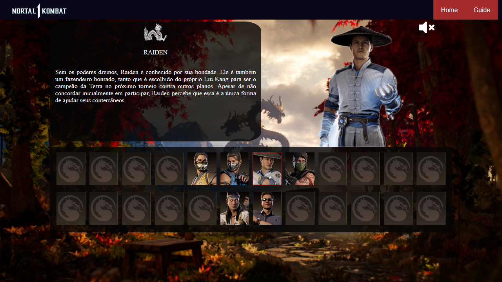

# MK1-WebSite
 Web Site que simula uma página do jogo Mortal Kombat 1

   
 Página simples onde ao selecionar um dos personagens o código em JS atualiza o avatar do lutador e uma breve descrição de sua história é apresentada em texto. Cada personagem escolhido vem seguido de uma voz chamando pelo seu nome. É possível desligar e ligar o som a qualquer momento selecionando o ícone de "fone" no canto superior direito.
 
 
   
 Um dos meus primeiros projetos em Html5, Css3 e JS. Muita pesquisa pra chegar no resultado apresentado.
>>>>>>> 70a1f8091ec27e806541117c9c3933a55eeee54c
